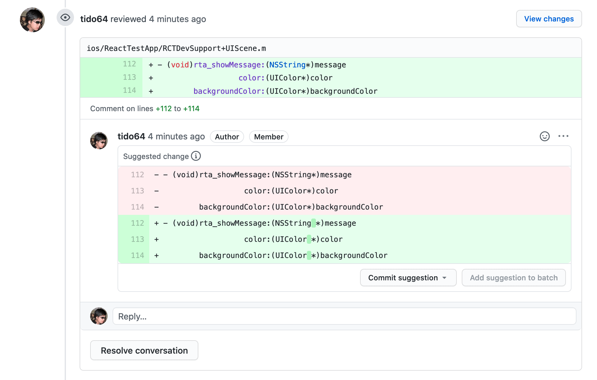

# suggestion-bot

[](https://github.com/tido64/suggestion-bot/actions/workflows/build.yml)
[](https://lgtm.com/projects/g/tido64/suggestion-bot/context:javascript)
[](https://codecov.io/gh/tido64/suggestion-bot)
[](https://www.npmjs.com/package/suggestion-bot)

`suggestion-bot` submits code reviews with suggestions based on your diffs.



## Usage

```
Usage: suggestion-bot [options] [diff]

submit code reviews with suggestions based on your diffs

Arguments:
  diff                 the diff to create suggestions from

Options:
  -V, --version        output the version number
  -m, --message <msg>  use the specified message as the PR comment
  -h, --help           display help for command

Examples:
  # Submit current changes as suggestions
  GITHUB_TOKEN=<secret> suggestion-bot "$(git diff)"

  # Alternatively, pipe to suggestion-bot
  # to avoid escape character issues
  git diff | GITHUB_TOKEN=<secret> suggestion-bot
```

If your CI is hosted by Azure DevOps, replace `GITHUB_TOKEN` with
`AZURE_PERSONAL_ACCESS_TOKEN`.

## Requirements

- Host your code on [GitHub](https://github.com/)
- A GitHub
  [personal access token](https://docs.github.com/en/github/authenticating-to-github/creating-a-personal-access-token)

-- or --

- Host your code on [Azure DevOps](https://dev.azure.com/)
- An Azure DevOps
  [personal access token](https://docs.microsoft.com/en-us/azure/devops/organizations/accounts/use-personal-access-tokens-to-authenticate?view=azure-devops&tabs=preview-page)

## Recipes

- [Using `suggestion-bot` with GitHub Actions](#using-suggestion-bot-with-github-actions)
- [Using `suggestion-bot` with `clang-format`](#using-suggestion-bot-with-clang-format)
- [Using `suggestion-bot` with Prettier](#using-suggestion-bot-with-prettier)

### Using `suggestion-bot` with GitHub Actions

1. Install `suggestion-bot` in your project

   ```sh
   yarn add suggestion-bot --dev
   ```

2. Configure your GitHub workflow so `suggestion-bot` can access the
   `GITHUB_TOKEN` secret provided by GitHub via an environment variable with the
   same name:

   ```yaml
   # .github/workflows/build.yml
   jobs:
     lint:
       runs-on: ubuntu-latest
       steps:
         - name: Set up Node.js
           uses: actions/setup-node@v1
           with:
             node-version: 12
         - name: Checkout
           uses: actions/checkout@v2
         - name: Install
           run: yarn
         - name: ClangFormat
           if: ${{ github.event_name == 'pull_request' }}
           env:
             GITHUB_TOKEN: ${{ secrets.GITHUB_TOKEN }}
           run: scripts/clang-format-diff.sh | yarn suggestion-bot
   ```

### Using `suggestion-bot` with `clang-format`

Use
[`clang-format-diff`](https://clang.llvm.org/docs/ClangFormat.html#script-for-patch-reformatting)
to format only changed files:

```sh
curl --silent --show-error --remote-name https://raw.githubusercontent.com/llvm/llvm-project/release/10.x/clang/tools/clang-format/clang-format-diff.py
git diff --unified=0 --no-color @^ \
  | python clang-format-diff.py -p1 -regex '.*\.(cpp|cc|c\+\+|cxx|c|cl|h|hh|hpp|m|mm|inc)' -sort-includes \
  | yarn suggestion-bot
```

### Using `suggestion-bot` with Prettier

We must first write a script that pipes [Prettier](https://prettier.io/)'s
output to `diff` so we can feed it to `suggestion-bot` later.

```js
#!/usr/bin/env node

const { spawnSync } = require("child_process");
const fs = require("fs");
const prettier = require("prettier");

const diff = process.argv.slice(2).reduce((diff, filepath) => {
  const source = fs.readFileSync(filepath, { encoding: "utf8" });
  const { stdout } = spawnSync("diff", ["--unified", filepath, "-"], {
    input: prettier.format(source, { filepath }),
    encoding: "utf-8",
  });
  return diff + stdout;
}, "");

require("suggestion-bot")(diff);
```

Save the script somewhere, e.g. `scripts/prettier-diff.js`, then invoke it with
Node:

```sh
node scripts/prettier-diff.js $(git ls-files '*.js')
```
